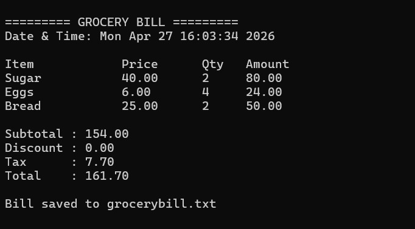

# 🛒 Grocery Billing System (C)

A console-based application that simulates a grocery store billing system with automated calculations and bill generation.

## 🚀 Features
- Menu-driven item selection
- Automatic subtotal calculation
- 5% discount on orders above Rs. 500
- 5% tax calculation
- Formatted bill display
- Saves bill to a text file
- Includes date & time of purchase

## 🛠️ Tech Used
- C Programming
- File Handling
- Structures

## 📸 Sample Output


## ▶️ How to Run
```bash
gcc grocery_billing_system.c -o bill
./bill
